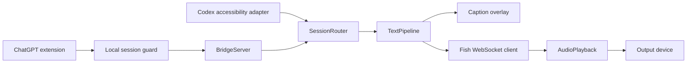

# Architecture and acceptance boundaries

## Contracts

- Idle start events cannot claim playback. Valid assistant text selects the turn.
- Stale sessions and idle sources cannot cancel the active source.
- Captions and synthesis share text without waiting for one another.
- Phrase boundaries and quiet timeouts preserve existing comma behavior.
- Playback epochs reject late audio. Uncertain interrupted phrases are not replayed.
- Fish errors and first/subsequent audio stalls open a fallback circuit; retry recreates
  the player. Unmuting cannot recover official audio already missed.
- DOM tracking preserves a long answer when a committed message changes identity and
  no new user message appeared. Later real turns can repeat the same answer.
- API Key uses Windows DPAPI and is never logged.

## Local protocol

Loopback port 17892; HTTP/WS require a random per-process bearer token.
The extension bootstraps via POST /session and X-VoiceBridge-Client: extension.
Website origins and browser cross-site bootstrap requests are rejected; no CORS
allowance is provided. Tokens stay in the service worker, not the page, and renew
after a 401. Same-user native programs and installed extensions are trusted.
Events are validated for type, source, session and size. Health omits user paths.

## Evidence and limits

- Offline transport, pipeline, DOM lifecycle, network hook and mute ownership tests.
- Bridge authorization, website rejection, validation and WebSocket closure tests.
- Maintainer computer: user-confirmed previous working build's web captions and Fish output.
- Pending current candidate: real browser authorization after upgrade, both Codex
  distributions, device changes, 30-minute use, spoken barge-in and repeated UI exit.
- Speaker AEC remains unaccepted. PCM receipt or active microphone track alone does
  not establish audible output or successful echo removal.

AEC reference classes remain in source for investigation. Python environments and
virtual drivers are not bundled; normal execution does not start them. Do not use
--echo-cancel with the public ZIP. No system audio loopback capture is used.
