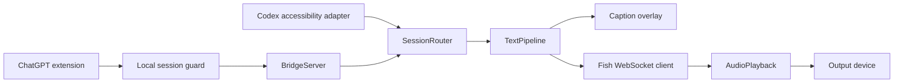

# Architecture and acceptance boundaries

## Contracts

- Idle start events cannot claim playback. Valid assistant text selects the turn.
- Stale sessions and idle sources cannot cancel the active source.
- Captions and synthesis share text without waiting for one another.
- Phrase boundaries and quiet timeouts preserve existing comma behavior.
- Playback epochs reject late audio. Uncertain interrupted phrases are not replayed.
- Fish errors and first/subsequent audio stalls open a fallback circuit; retry recreates
  the player. Unmuting cannot recover official audio already missed.
- DOM tracking preserves a long answer when a committed message changes identity and
  no new user message appeared. Later real turns can repeat the same answer.
- API Key uses Windows DPAPI and is never logged.

## Local protocol

Loopback port 17892; HTTP/WS require a random per-process bearer token.
The extension bootstraps via POST /session and X-VoiceBridge-Client: extension.
Website origins and browser cross-site bootstrap requests are rejected; no CORS
allowance is provided. Tokens stay in the service worker, not the page, and renew
after a 401. Same-user native programs and installed extensions are trusted.
Events are validated for type, source, session and size. Health omits user paths.

## Evidence and limits

- Offline transport, pipeline, DOM lifecycle, network hook and mute ownership tests.
- Bridge authorization, website rejection, validation and WebSocket closure tests.
- Maintainer computer: user-confirmed previous working build's web captions and Fish output.
- Pending current candidate: real browser authorization after upgrade, both Codex
  distributions, device changes, 30-minute use, spoken barge-in and repeated UI exit.
- Speaker AEC remains unaccepted. PCM receipt or active microphone track alone does
  not establish audible output or successful echo removal.

## 0.3.1 candidate: duplex audio ownership

The optional bundled engine owns Fish speaker playback and physical microphone
capture in one 48-kHz duplex callback. The exact rendered PCM is its echo
reference. No system loopback is opened. A partitioned linear adaptive filter
and WebRTC residual control produce the virtual microphone stream. Independent
near-end energy is preserved; the microphone is never muted during playback.

Device timestamps alone were unreliable on the maintainer's WASAPI driver.
Reference/microphone correlation therefore estimates acoustic delay when
confidence is sufficient. Correlation also prevents cold-start speaker echo
from being treated as an interruption. Neither metric alone proves useful AEC.

PCM IPC on loopback 17896 requires a random per-helper token; website Origins
are refused. Eight seconds of queued audio is a hard bound. Backpressure awaits
space without holding the generation lock; interrupts can cancel immediately.
Epochs reject old audio. Helper loss, stale callbacks or a failed virtual input
disables replacement. A stable browser audio track switches to the already-open
physical fallback when helper readiness expires, without ending the Voice call.

VB-CABLE remains an external prerequisite, not a bundled or automatically
installed driver. The candidate test launcher uses --candidate for separate
settings; the 0.3.0 Release and daily desktop shortcut remain available.
